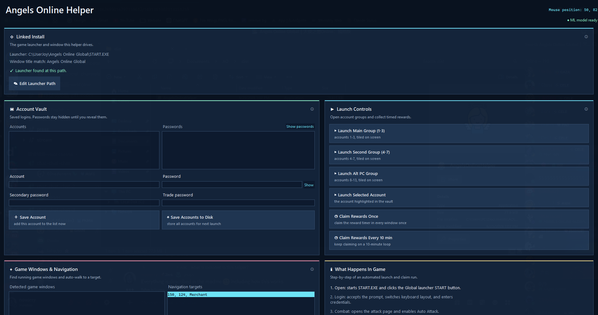

# Angels Online Helper

A modern windowed helper for the MMO **Angels Online Global**. It launches your
accounts, logs them in, collects timed rewards, and can auto-walk a character to
a target.

Every button that launches the game, claims rewards, navigates, or writes a file
first shows a preview pop-up that explains exactly what will happen and what it
needs. If something it needs is missing, the pop-up flags it with a red cross as
a warning, but still lets you proceed if you want to try.

<p align="center">
  
</p>

---

## Bugs and feature requests

Found a bug, or want a feature added in a future version? Send me a direct
message on Discord - my handle is **`no.sorry`** - and I will take a look.

---

## Support

If this helper is useful to you, you can support its development on Ko-fi:

[](https://ko-fi.com/nosorry)

---

## For users: what you need

**You only need two things:**

1. **Windows 10 or 11.**
2. **Angels Online Global installed**, with its `START.EXE` launcher.

That is it. You do **not** need to install Python, any libraries, or a machine
learning runtime. Everything the helper needs is bundled inside the executable.

### What is already inside the executable

`AngelsOnlineHelper.exe` is self-contained. Bundled inside it are:

- the Python runtime (you do not install Python),
- the GUI toolkit (Tcl/Tk),
- `onnxruntime` plus the navigation model `my_model.onnx` (used to read your
  character's on-screen coordinates for Auto Navigate),
- the template images in `image/` used to find buttons and the reward timer,
- a default launcher configuration (`start_game.json`).

Because the runtime uses `onnxruntime` instead of TensorFlow, the executable is
around 100-150 MB instead of 700 MB+.

### Files the helper creates next to the executable

- **`start_game.json`** - your launcher path and the window title to match.
  Created/updated when you use **Edit Launcher Path**.
- **`data.json`** - your saved accounts. Created when you use
  **Save Accounts to Disk**.

---

## Getting started

1. Download `AngelsOnlineHelper.exe` and run it. The window opens in normal
   (windowed) size; the whole layout scrolls, so a short screen still shows every
   panel and the Activity Log at the bottom.
2. Check the **Linked Install** panel at the top:
   - The default launcher path is:

     ```text
     C:\UserJoy\Angels Online Global\START.EXE
     ```

   - If the path is correct, the panel shows a green **"Launcher found at this
     path."** If it shows a red **"Launcher not found"**, click
     **✎ Edit Launcher Path** and enter the full path to your `START.EXE` and the
     game window title to match. Your choice is saved to `start_game.json`.
3. Add your accounts in the **Account Vault**, then click
   **⇩ Save Accounts to Disk** so they load automatically next time.

### Passwords

Passwords are **hidden by default**. In the **Account Vault**:

- Click **Show passwords** to reveal the whole list, and
  **Hide passwords** to mask it again.
- The password input field is masked as you type, with a small eye to reveal just
  that field.

---

## What each button does

Hover any button to see a tooltip. Action buttons also show a preview pop-up
(with a numbered "What will happen" list and a checklist of requirements) before
they run.

### Linked Install

- **✎ Edit Launcher Path** - set where the game is installed: the full path to
  `START.EXE` and the window title the helper waits for. Saved to `start_game.json`.
  The panel shows whether the current path is valid every time the app starts and
  after you edit it.

### Account Vault

- **＋ Save Account** - add the account and password typed below to the list right
  now. This only updates the in-memory list for this session.
- **⇩ Save Accounts to Disk** - write every account in the vault to `data.json`
  beside the app so they load automatically next launch. Shows a preview first,
  and asks again before overwriting an existing `data.json`. **Needs** at least
  one account in the vault.

### Launch Controls

Each Launch button starts `START.EXE` once per account, clicks the launcher's
START button, logs in, enables Auto Attack, then tiles and minimizes the window.

- **▶ Launch Main Group (1-3)** - launch saved accounts 1-3.
  **Needs** the launcher path to be valid and at least 3 saved accounts.
- **▶ Launch Second Group (4-7)** - launch saved accounts 4-7.
  **Needs** the launcher path and at least 7 saved accounts.
- **▶ Launch Alt PC Group** - launch saved accounts 8-13.
  **Needs** the launcher path and at least 13 saved accounts.
- **▶ Launch Selected Account** - launch only the account highlighted in the
  Account Vault. **Needs** the launcher path and a selected account.
- **◷ Claim Rewards Once** - restore each open game window, click its reward timer
  once, then minimize it. **Needs** at least one open game window.
- **◷ Claim Rewards Every 10 min** - the same claim, repeated every 10 minutes for
  5 passes. **Needs** at least one open game window.

### Game Windows & Navigation

- **⟳ Refresh Window List** - scan for open Angels Online windows and list them on
  the left. Read-only; run it before Auto Navigate so a window is available to
  select.
- **⌖ Auto Navigate** - walk the selected game window's character toward the
  selected target. It reads the on-screen coordinates with the bundled model.
  **Needs** the model to be ready, a game window selected, and a target
  selected. The header chip shows **● ML model ready** when the model loaded, or
  **● ML unavailable** if it failed (which disables Auto Navigate).

### Activity Log

The bottom panel shows live output from the helper. The release executable runs with
no console window, so this is where all messages appear.

---

## How it works

**Launching and login.** For each account in a group, the helper runs `START.EXE`,
clicks the Global launcher's **START** button, accepts the agreement prompt, sets
the keyboard layout, and types the account credentials (read from your saved list,
never from the masked display). It then opens the attack page, enables Auto
Attack, and tiles/minimizes the new game window.

**Claiming rewards.** The helper finds every window whose title matches your game
window title, restores and focuses each one, screenshots it, locates the reward
timer icon by template matching, clicks it, and minimizes the window again. The
loop variant repeats this on a 10-minute timer.

**Auto Navigate.** The bundled ONNX model reads the digits of your character's
coordinates from the screen. The helper compares them to the chosen target and clicks
to move until the character arrives.

**Why a button might warn you.** Each action checks its requirements (a valid
launcher path, enough saved accounts, an open or selected window, the model being
ready) and shows them in the preview pop-up with a green check or a red cross.
A red cross is a warning, not a block: you always see the explanation first and
can still choose to proceed, so a button never runs without an explanation.

---

## Build from source (developers)

Install dependencies and build from PowerShell:

```powershell
.\build_exe.ps1
```

The release executable is created at:

```text
dist\AngelsOnlineHelper.exe
```

The build bundles `image/`, `my_model.onnx`, `start_game.json`, and the Tcl/Tk
data into a single `--onefile --windowed` executable. The runtime uses
`onnxruntime` for navigation inference; TensorFlow is **not** bundled.

### Regenerating the navigation model (maintainers)

`my_model.onnx` is produced from `my_model.h5` with a dev-only converter that also
validates Keras/ONNX label parity:

```powershell
.\.venv\Scripts\python.exe -m pip install -r requirements-dev.txt
.\.venv\Scripts\python.exe convert_model.py
```

Commit the regenerated `my_model.onnx`. TensorFlow and `tf2onnx` are only needed
for this step, never for the shipped executable.

### Running the tests

```powershell
.\.venv\Scripts\python.exe -m unittest -v
```

---

## Credits

The initial idea for this project came from
[Bobo100/angels-online-afk-bot](https://github.com/Bobo100/angels-online-afk-bot).
Thanks for the inspiration.

---

<p align="center">
  
</p>
